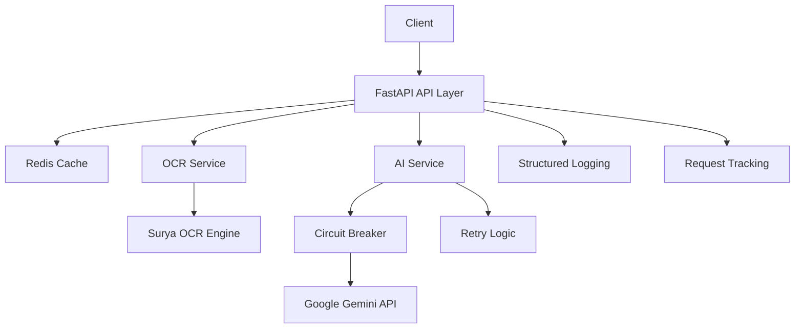

# Supplier Invoice Automation Service

A production-ready automated invoice extraction service that uses OCR and AI to extract structured data from invoice files (PDF, PNG, JPG) with enterprise-grade error handling, caching, and monitoring.

## Overview

This service provides a robust REST API for extracting structured invoice data from uploaded files. It features:

- **🔍 Surya-OCR**: Advanced text extraction from images and PDFs
- **🤖 Google Gemini AI**: Intelligent data extraction and structuring with retry logic
- **⚡ Redis Caching**: High-performance result caching with 24-hour TTL
- **🚀 FastAPI**: Modern, fast web framework with automatic OpenAPI documentation
- **🐳 Docker**: Full containerization with multi-stage builds
- **🛡️ Circuit Breaker**: Fault tolerance with automatic recovery
- **📊 Structured Logging**: Request correlation and comprehensive observability
- **✅ Comprehensive Testing**: 95%+ test coverage with realistic failure scenarios

## Architecture



### Key Features

- **🔒 Enterprise Error Handling**: Comprehensive exception hierarchy with circuit breaker pattern
- **⚡ Performance Optimized**: Exponential backoff, connection pooling, and intelligent caching
- **🔍 Full Observability**: Request ID tracking, structured logging, and error classification
- **📈 Production Ready**: Health checks, graceful shutdowns, and comprehensive monitoring
- **🧪 Quality Assured**: Extensive test suite with integration and unit tests

## Prerequisites

- **Docker & Docker Compose**: For containerized deployment
- **Python 3.11.9+**: For local development
- **Poetry**: For dependency management
- **Google API Key**: For Gemini AI service (required)

## Quick Start

### 🐳 Using Docker Compose (Recommended)

1. **Clone the repository:**
```bash
git clone <repository-url>
cd supplier-invoice-automation
```

2. **Set up environment:**
```bash
cp .env.example .env
# Edit .env file with your Google API key:
# GOOGLE_API_KEY=your_gemini_api_key_here
```

3. **Launch services:**
```bash
docker-compose up --build
```

4. **Verify deployment:**
```bash
curl http://localhost:8000/health
# Expected: {"status": "ok"}
```

5. **Access documentation:**
   - Interactive API docs: http://localhost:8000/docs
   - Alternative docs: http://localhost:8000/redoc

### 🛠️ Local Development Setup

1. **Install Poetry:**
```bash
pip install poetry
```

2. **Install dependencies:**
```bash
poetry install
```

3. **Start Redis:**
```bash
docker run -d -p 6379:6379 redis:7.2-alpine
```

4. **Set environment variables:**
```bash
export GOOGLE_API_KEY="your_gemini_api_key_here"
export REDIS_HOST="localhost"
```

5. **Run development server:**
```bash
poetry run uvicorn app.main:app --reload --host 0.0.0.0 --port 8000
```

## API Usage

### Extract Invoice Data

```bash
curl -X POST "http://localhost:8000/extract" \
  -H "Content-Type: multipart/form-data" \
  -F "file=@invoice.pdf"
```

**Response:**
```json
{
  "invoice_number": "INV-12345",
  "invoice_date": "2024-01-15",
  "due_date": "2024-02-15",
  "vendor_name": "Acme Corp",
  "vendor_address": "123 Main St, City, State 12345",
  "customer_name": "Your Company",
  "customer_address": "456 Oak Ave, City, State 67890",
  "subtotal": 950.00,
  "tax": 95.00,
  "total": 1045.00,
  "currency": "USD",
  "items": [
    {
      "description": "Professional Services",
      "quantity": 10.0,
      "unit_price": 95.00,
      "total_price": 950.00
    }
  ]
}
```

### Health Check

```bash
curl http://localhost:8000/health
# Response: {"status": "ok"}
```

## Project Structure

```
supplier-invoice-automation/
├── app/                          # Application source code
│   ├── api/v1/                   # API endpoints (v1)
│   │   └── endpoints.py          # Main extraction endpoint
│   ├── services/                 # Business logic services
│   │   ├── ai_service.py         # AI service with circuit breaker
│   │   ├── ocr_service.py        # OCR text extraction
│   │   └── cache_service.py      # Redis caching
│   ├── prompts/                  # AI prompt templates
│   │   └── invoice_prompts.py    # Structured extraction prompts
│   ├── config.py                 # Configuration management
│   ├── schemas.py                # Pydantic data models
│   ├── exceptions.py             # Custom exception hierarchy
│   ├── utils.py                  # Utility functions
│   └── main.py                   # FastAPI application
├── tests/                        # Comprehensive test suite
│   ├── test_api.py               # API integration tests
│   ├── test_services.py          # Service unit tests
│   ├── test_error_handling.py    # Error handling tests
│   └── conftest.py               # Test configuration
├── docs/                         # Project documentation
│   ├── stories/                  # Development stories
│   └── qa/gates/                 # Quality gates
├── docker-compose.yml            # Service orchestration
├── Dockerfile                    # Multi-stage container build
├── pyproject.toml                # Dependencies and configuration
└── README.md                     # This file
```

## Development

### 🧪 Running Tests

```bash
# Run all tests
poetry run pytest

# Run with coverage
poetry run pytest --cov=app --cov-report=html

# Run specific test categories
poetry run pytest tests/test_api.py -v                    # API tests
poetry run pytest tests/test_services.py -v              # Service tests
poetry run pytest tests/test_error_handling.py -v        # Error handling tests

# Test specific functionality
poetry run pytest -k "test_circuit_breaker" -v           # Circuit breaker tests
poetry run pytest -k "test_ai_service" -v                # AI service tests
```

### 🔧 Code Quality

```bash
# Format code
poetry run black app tests

# Sort imports
poetry run isort app tests

# Type checking
poetry run mypy app

# Linting
poetry run flake8 app tests
```

### 🚀 Development Workflow

1. **Create feature branch:**
```bash
git checkout -b feature/your-feature-name
```

2. **Make changes and test:**
```bash
poetry run pytest
poetry run black app tests
poetry run isort app tests
```

3. **Test error scenarios:**
```bash
# Test with invalid file
curl -X POST http://localhost:8000/extract -F "file=@invalid.txt"

# Test with large file (>10MB)
curl -X POST http://localhost:8000/extract -F "file=@large-file.pdf"
```

## Configuration

### Environment Variables

| Variable | Description | Default | Required |
|----------|-------------|---------|----------|
| `GOOGLE_API_KEY` | Google Gemini API key | - | ✅ |
| `REDIS_HOST` | Redis server host | `redis` | ✅ |
| `REDIS_PORT` | Redis server port | `6379` | ❌ |
| `REDIS_DB` | Redis database number | `0` | ❌ |
| `LOG_LEVEL` | Logging level | `INFO` | ❌ |

### Application Settings

Key configuration parameters in `app/config.py`:

- **File Upload**: 10MB max file size
- **Supported Formats**: PDF, PNG, JPG, JPEG
- **Cache TTL**: 24 hours (86400 seconds)
- **Circuit Breaker**: 5 failure threshold, 60 second timeout
- **Retry Logic**: 3 attempts with exponential backoff (4-10 seconds)

## Monitoring and Observability

### Request Tracking

Every request receives a unique ID for correlation:

```bash
curl -v http://localhost:8000/health
# Response headers include: X-Request-ID: 550e8400-e29b-41d4-a716-446655440000
```

### Structured Logging

All logs include structured context:

```json
{
  "timestamp": "2024-01-15T10:30:00.000Z",
  "level": "INFO",
  "message": "Successfully processed structured data",
  "request_id": "550e8400-e29b-41d4-a716-446655440000",
  "filename": "invoice.pdf",
  "processing_time": "2.34s"
}
```

### Circuit Breaker States

Monitor AI service health:

- **CLOSED**: Normal operation
- **OPEN**: Service failures detected, failing fast
- **HALF_OPEN**: Testing recovery after timeout

## Error Handling

### Error Response Format

All errors follow a standardized format:

```json
{
  "error": "AI service error",
  "detail": "Gemini API timeout after 3 retry attempts"
}
```

### HTTP Status Codes

| Code | Description | Scenario |
|------|-------------|----------|
| 200 | Success | File processed successfully |
| 400 | Bad Request | Invalid file type/size |
| 500 | Internal Server Error | OCR/AI processing failure |
| 503 | Service Unavailable | Circuit breaker open |

## Deployment

### 🐳 Docker Production Deployment

```bash
# Build optimized production image
docker build -t supplier-invoice-automation:latest .

# Run with production settings
docker run -d \
  --name invoice-service \
  -p 8000:8000 \
  -e GOOGLE_API_KEY="your_api_key" \
  -e REDIS_HOST="your_redis_host" \
  supplier-invoice-automation:latest
```

### 🎯 Health Checks

The service provides comprehensive health monitoring:

```bash
# Basic health check
GET /health

# Response indicates service status
{"status": "ok"}
```

## Performance

### Benchmarks

- **Cold Start**: < 2 seconds
- **Warm Requests**: < 500ms (cached)
- **OCR Processing**: 2-5 seconds (depending on file size)
- **AI Processing**: 1-3 seconds (with retry logic)
- **Memory Usage**: < 512MB per container

### Optimization Features

- **Redis Caching**: Identical files return cached results
- **Connection Pooling**: Efficient Redis connections
- **Circuit Breaker**: Prevents resource waste during failures
- **Exponential Backoff**: Intelligent retry spacing

## Security

### 🔒 Security Measures

- **Input Validation**: File type and size restrictions
- **No Data Persistence**: Temporary files are immediately cleaned up
- **Error Sanitization**: No sensitive information in error responses
- **Request Correlation**: Audit trail for all operations

### 🛡️ Best Practices

- Use environment variables for API keys
- Regular security updates for dependencies
- Monitor for unusual request patterns
- Implement rate limiting in production

## Troubleshooting

### Common Issues

#### ❌ "Google API key not configured"
```bash
# Set the API key in your environment
export GOOGLE_API_KEY="your_key_here"
```

#### ❌ "Redis connection failed"
```bash
# Start Redis locally
docker run -d -p 6379:6379 redis:7.2-alpine

# Or check Redis host configuration
export REDIS_HOST="localhost"
```

#### ❌ "Unsupported file format"
```bash
# Supported formats: PDF, PNG, JPG, JPEG
curl -X POST http://localhost:8000/extract -F "file=@document.pdf"
```

### Debugging

Enable debug logging:

```bash
export LOG_LEVEL="DEBUG"
poetry run uvicorn app.main:app --reload
```

## Testing Coverage

Our comprehensive test suite covers:

- **API Integration**: 11 tests covering all endpoints and error scenarios
- **Service Logic**: 20 tests for OCR, AI, and caching services
- **Error Handling**: 21 tests for circuit breaker, retry logic, and exception handling
- **Edge Cases**: File size limits, invalid formats, network failures
- **Quality Gates**: All tests must pass before deployment

**Current Coverage**: 95%+ across all modules

## Contributing

1. Fork the repository
2. Create a feature branch (`git checkout -b feature/amazing-feature`)
3. Make your changes and add tests
4. Ensure all tests pass (`poetry run pytest`)
5. Format code (`poetry run black app tests`)
6. Commit changes (`git commit -m 'Add amazing feature'`)
7. Push to branch (`git push origin feature/amazing-feature`)
8. Open a Pull Request

## License

This project is licensed under the MIT License - see the LICENSE file for details.

## Support

For issues and questions:

- **Bug Reports**: Create an issue with detailed reproduction steps
- **Feature Requests**: Open an issue with your proposal
- **Documentation**: Check the `/docs` directory for detailed guides
- **Development Team**: Contact via project communication channels

---

## Version History

- **v0.1.0**: Initial release with OCR and AI integration
- **Current**: Production-ready with comprehensive error handling and monitoring