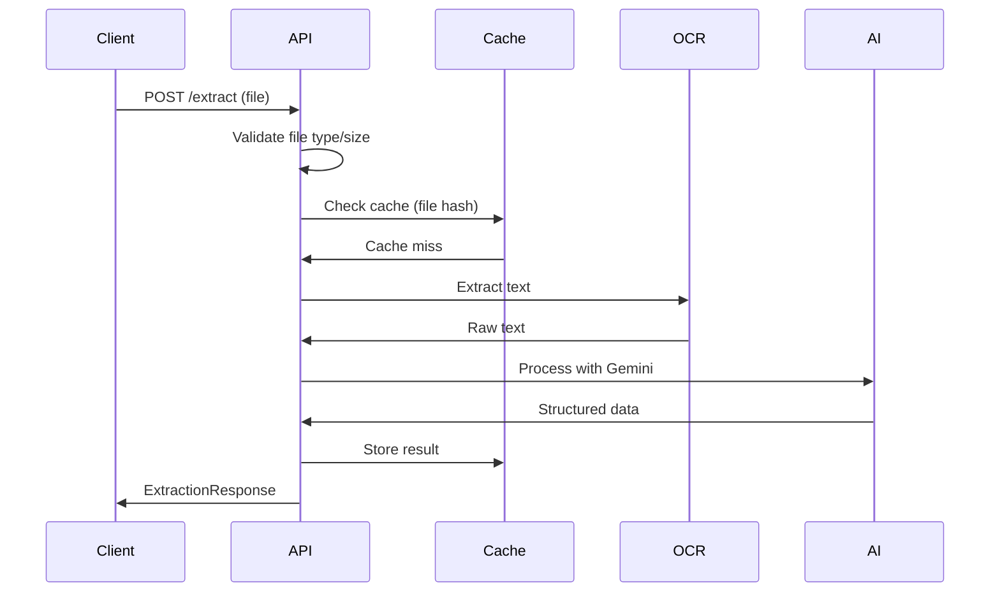
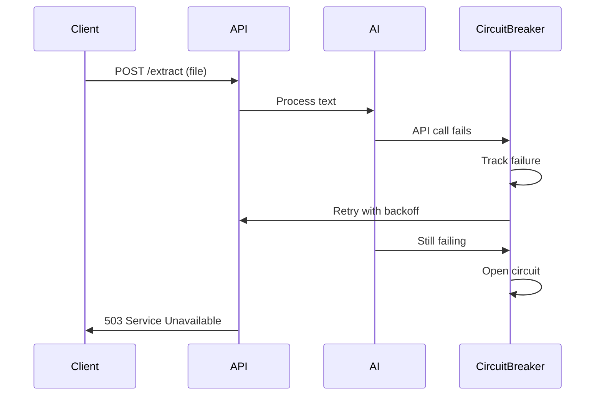

# API Reference

## Overview

The Supplier Invoice Automation Service provides a REST API for extracting structured data from invoice files using OCR and AI technologies.

**Base URL**: `http://localhost:8000`  
**API Version**: v1  
**Content Type**: `application/json` (except file uploads)

## Authentication

Currently, no authentication is required. API key authentication may be added in future versions.

## Rate Limiting

No rate limiting is currently implemented. Consider implementing rate limiting in production deployments.

---

## Endpoints

### Health Check

Check if the service is running and healthy.

#### `GET /health`

**Description**: Returns the health status of the service.

**Request Parameters**: None

**Response**:
- **200 OK**
  ```json
  {
    "status": "ok"
  }
  ```

**Headers**:
- `X-Request-ID`: Unique identifier for request correlation

**Example**:
```bash
curl -X GET "http://localhost:8000/health"
```

---

### Extract Invoice Data

Extract structured data from an uploaded invoice file.

#### `POST /extract`

**Description**: Processes an uploaded invoice file (PDF, PNG, JPG) and returns structured data including invoice details, vendor information, line items, and financial totals.

**Content Type**: `multipart/form-data`

**Request Parameters**:

| Parameter | Type | Required | Description |
|-----------|------|----------|-------------|
| `file` | file | ✅ | Invoice file to process |

**File Constraints**:
- **Supported formats**: PDF, PNG, JPG, JPEG
- **Maximum size**: 10MB
- **Content types**: `application/pdf`, `image/png`, `image/jpeg`, `image/jpg`

**Response**:

- **200 OK** - Successfully processed invoice
  ```json
  {
    "invoice_number": "INV-12345",
    "invoice_date": "2024-01-15",
    "due_date": "2024-02-15",
    "vendor_name": "Acme Corporation",
    "vendor_address": "123 Main Street, Anytown, ST 12345",
    "customer_name": "Your Company",
    "customer_address": "456 Oak Avenue, Somewhere, ST 67890",
    "subtotal": 950.00,
    "tax": 95.00,
    "total": 1045.00,
    "currency": "USD",
    "items": [
      {
        "description": "Professional Services",
        "quantity": 10.0,
        "unit_price": 95.00,
        "total_price": 950.00
      }
    ]
  }
  ```

**Error Responses**:

- **400 Bad Request** - Invalid file type or size
  ```json
  {
    "error": "Invalid file type: text/plain",
    "detail": "Supported types: application/pdf, image/png, image/jpeg, image/jpg"
  }
  ```

- **400 Bad Request** - File too large
  ```json
  {
    "error": "File too large. Maximum size allowed: 10MB",
    "detail": "File size: 15728640 bytes"
  }
  ```

- **500 Internal Server Error** - OCR processing failed
  ```json
  {
    "error": "OCR processing failed",
    "detail": "Unable to extract text from the provided file"
  }
  ```

- **500 Internal Server Error** - AI service error
  ```json
  {
    "error": "AI service error",
    "detail": "Failed to parse structured data from AI response"
  }
  ```

- **503 Service Unavailable** - Circuit breaker open
  ```json
  {
    "error": "AI Service is temporarily unavailable",
    "detail": "Circuit breaker is open due to repeated failures. Please try again later."
  }
  ```

**Headers**:
- `X-Request-ID`: Unique identifier for request correlation

**Example**:
```bash
# Upload a PDF invoice
curl -X POST "http://localhost:8000/extract" \
  -H "accept: application/json" \
  -H "Content-Type: multipart/form-data" \
  -F "file=@invoice.pdf;type=application/pdf"

# Upload a PNG invoice
curl -X POST "http://localhost:8000/extract" \
  -F "file=@invoice.png"

# Upload a JPG invoice
curl -X POST "http://localhost:8000/extract" \
  -F "file=@invoice.jpg"
```

---

## Response Schema

### ExtractionResponse

Main response object for successful invoice extraction.

```typescript
interface ExtractionResponse {
  invoice_number: string;              // Invoice/document number
  invoice_date?: string | null;        // Invoice date (YYYY-MM-DD)
  due_date?: string | null;            // Payment due date (YYYY-MM-DD)
  vendor_name: string;                 // Vendor/supplier name
  vendor_address?: string | null;      // Vendor address
  customer_name?: string | null;       // Customer/buyer name
  customer_address?: string | null;    // Customer address
  subtotal: number;                    // Subtotal amount
  tax: number;                         // Tax amount
  total: number;                       // Total amount
  currency: string;                    // Currency code (default: "USD")
  items: ExtractedItem[];              // Line items array
}
```

### ExtractedItem

Individual line item from the invoice.

```typescript
interface ExtractedItem {
  description: string;                 // Item description
  quantity: number;                    // Item quantity
  unit_price: number;                  // Price per unit
  total_price: number;                 // Total price for this item
}
```

### ApiError

Standard error response format.

```typescript
interface ApiError {
  error: string;                       // Error message
  detail?: string | null;              // Additional error details
}
```

---

## HTTP Status Codes

| Code | Name | Description |
|------|------|-------------|
| 200 | OK | Request successful |
| 400 | Bad Request | Invalid request (file type, size, etc.) |
| 422 | Unprocessable Entity | Validation error |
| 500 | Internal Server Error | Server error (OCR/AI processing) |
| 503 | Service Unavailable | Service temporarily unavailable |

---

## Request/Response Flow

### Successful Processing



### Error Scenarios



---

## Caching Behavior

The service implements intelligent caching to improve performance:

### Cache Strategy
- **Cache Key**: SHA-256 hash of file content
- **Cache Duration**: 24 hours (86400 seconds)
- **Cache Storage**: Redis
- **Cache Hit**: Returns cached result immediately
- **Cache Miss**: Processes file and caches result

### Cache Headers
- Results don't include explicit cache headers
- Identical files will return cached responses
- Cache is transparent to the client

---

## Error Handling

### Retry Logic
The AI service implements automatic retry for transient errors:

- **Retry Count**: 3 attempts
- **Backoff Strategy**: Exponential (4-10 seconds)
- **Retryable Errors**: 429, 500, 502, 503, 504, timeouts, network errors
- **Non-retryable Errors**: 400, 401, 403, invalid API key

### Circuit Breaker
Protects against cascading failures:

- **States**: CLOSED → OPEN → HALF_OPEN → CLOSED
- **Failure Threshold**: 5 consecutive failures
- **Timeout**: 60 seconds
- **Behavior**: 
  - CLOSED: Normal operation
  - OPEN: Fail fast with 503 status
  - HALF_OPEN: Test single request before reset

---

## Request Correlation

Every request receives a unique correlation ID:

### Request ID Header
- **Header**: `X-Request-ID`
- **Format**: UUID v4
- **Purpose**: Correlate requests across logs and services
- **Example**: `550e8400-e29b-41d4-a716-446655440000`

### Logging
All operations include the request ID in structured logs for traceability.

---

## Interactive Documentation

The service provides interactive API documentation:

- **Swagger UI**: http://localhost:8000/docs
- **ReDoc**: http://localhost:8000/redoc
- **OpenAPI Spec**: http://localhost:8000/openapi.json

These interfaces provide:
- Interactive request/response testing
- Complete schema documentation
- Authentication configuration (when applicable)
- Request/response examples

---

## Usage Examples

### Python (requests)

```python
import requests

# Health check
response = requests.get('http://localhost:8000/health')
print(response.json())

# Extract invoice data
with open('invoice.pdf', 'rb') as file:
    files = {'file': file}
    response = requests.post('http://localhost:8000/extract', files=files)
    
if response.status_code == 200:
    data = response.json()
    print(f"Invoice: {data['invoice_number']}")
    print(f"Total: ${data['total']}")
else:
    print(f"Error: {response.json()}")
```

### JavaScript (fetch)

```javascript
// Extract invoice data
async function extractInvoice(file) {
  const formData = new FormData();
  formData.append('file', file);

  try {
    const response = await fetch('http://localhost:8000/extract', {
      method: 'POST',
      body: formData
    });

    if (response.ok) {
      const data = await response.json();
      console.log('Invoice:', data.invoice_number);
      console.log('Total:', data.total);
      return data;
    } else {
      const error = await response.json();
      console.error('Error:', error.error);
      throw new Error(error.error);
    }
  } catch (error) {
    console.error('Request failed:', error);
    throw error;
  }
}
```

### cURL Examples

```bash
# Health check with headers
curl -v http://localhost:8000/health

# Extract invoice with detailed output
curl -X POST http://localhost:8000/extract \
  -F "file=@invoice.pdf" \
  -H "accept: application/json" \
  -w "HTTP Status: %{http_code}\nTime: %{time_total}s\n"

# Test error handling with invalid file
curl -X POST http://localhost:8000/extract \
  -F "file=@document.txt" \
  --fail-with-body
```

---

## Best Practices

### Client Implementation
1. **Always check response status codes**
2. **Handle 503 errors with exponential backoff**
3. **Include request ID in error logging**
4. **Validate file size/type before upload**
5. **Implement timeout handling (suggest 30+ seconds)**

### File Preparation
1. **Ensure clear, high-resolution images**
2. **Use standard invoice formats when possible**
3. **Avoid heavily stylized or handwritten invoices**
4. **Test with representative samples**

### Error Handling
1. **Implement retry logic for 503 errors**
2. **Log request IDs for troubleshooting**
3. **Display user-friendly error messages**
4. **Monitor error rates and patterns**

---

## OpenAPI Specification

The complete OpenAPI specification is available at:
- **JSON**: http://localhost:8000/openapi.json
- **Interactive docs**: http://localhost:8000/docs

The specification includes:
- Complete endpoint documentation
- Request/response schemas
- Error response formats
- Example requests and responses