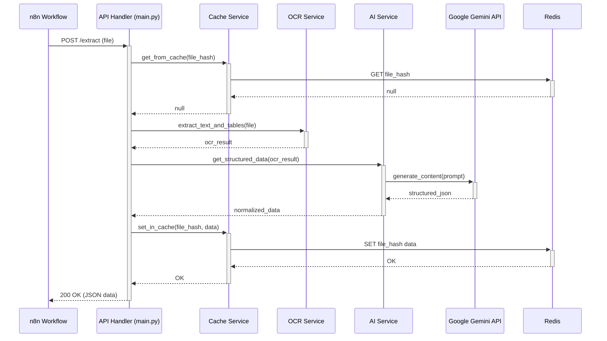

# Invoice OCR & AI Extraction Service Architecture Document

## 1. Introduction

This document outlines the overall project architecture for the Invoice OCR & AI Extraction Service, including backend systems, shared services, and non-UI specific concerns. Its primary goal is to serve as the guiding architectural blueprint for AI-driven development, ensuring consistency and adherence to chosen patterns and technologies.

**Relationship to Frontend Architecture:**
If the project includes a significant user interface, a separate Frontend Architecture Document will detail the frontend-specific design and MUST be used in conjunction with this document. Core technology stack choices documented herein (see "Tech Stack") are definitive for the entire project, including any frontend components.

### 1.1. Starter Template or Existing Project

Based on the PRD, the project will use Python and FastAPI. No specific starter template was mentioned. While we can build this from scratch, using a well-structured starter template can accelerate setup, enforce best practices, and provide a solid foundation.

**Recommendation:** I recommend using a standard FastAPI starter template, such as one that includes pre-configured Docker support, dependency management with Poetry, and a logical directory structure. This aligns with the PRD's technical assumptions and will save initial setup time.

**Decision:** We will proceed with the understanding that a standard FastAPI project structure will be created manually, as no starter template is specified.

### 1.2. Change Log

| Date | Version | Description | Author |
| :--- | :--- | :--- | :--- |
| 2025-09-02 | 0.1 | Initial document creation | Winston (Architect) |

---

## 2. High Level Architecture

### 2.1. Technical Summary

The system is designed as a standalone, containerized microservice following a RESTful architecture. The core components include a FastAPI web server providing the main API, a dedicated OCR service utilizing Surya-OCR for text and table extraction, an AI service for structured data extraction via the Gemini API, and a Redis cache to store results of previously processed invoices. This architecture directly supports the PRD's goals of creating an independent, high-performance, and cost-effective invoice processing service.

### 2.2. High Level Overview

The primary architectural style is a **Microservice**, as this application is a self-contained service responsible for a single business capability (invoice data extraction). It will be managed in its own repository (**Polyrepo** model), as implied by the PRD's repository structure.

The data flow is as follows:
1.  The `n8n` workflow sends a `POST` request with a file (PDF/image) to the `/extract` endpoint.
2.  The service calculates a hash of the file and checks the Redis cache. If a result exists, it is returned immediately.
3.  If not in the cache, the file is passed to the **Surya-OCR Service** for text, line, and table detection.
4.  The extracted text and table data are passed to the **AI Service**, which uses a structured prompt to call the Gemini API.
5.  The resulting JSON from the AI is normalized (e.g., date formats, number conversion).
6.  The final, structured JSON data is stored in the Redis cache and returned to the `n8n` workflow.

### 2.3. High Level Project Diagram

```mermaid
graph TD
    subgraph "Invoice OCR Service (Docker)"
        direction LR
        A[FastAPI Endpoint /extract] --> B{Cache Check};
        B -- "Cache Miss" --> C[OCR Service (Surya)];
        C --> D[AI Service (Gemini)];
        D --> E[Data Normalization];
        E --> F[Store in Cache];
        F --> G[JSON Response];
        B -- "Cache Hit" --> G;
    end

    subgraph "External Systems"
        N8N([n8n Workflow]);
        R([Redis Cache]);
        AI_API([Google Gemini API]);
    end

    N8N -- "POST PDF/Image" --> A;
    A --> R;
    C --> AI_API;
    F -.-> R;
    G -- "Success/Error" --> N8N;

    style A fill:#90EE90
```

### 2.4. Architectural and Design Patterns

- **Microservice Architecture:** The service is designed as a single, independently deployable unit focused exclusively on invoice processing.
    - _Rationale:_ This decouples the complex OCR/AI logic from the main n8n orchestration, allowing it to be scaled, updated, and maintained separately.
- **REST API:** The service exposes its functionality via a simple, stateless HTTP interface.
    - _Rationale:_ This is a universally understood standard that ensures easy integration with clients like n8n and simplifies testing.
- **Repository Pattern:** The application logic will interact with external services (OCR, AI, Cache) through dedicated service modules/repositories.
    - _Rationale:_ This decouples the core business logic from the specific implementation of external tools. For example, we can easily swap out `Gemini` for `Claude` in the `AIService` without changing the main application flow.
- **Cache-Aside Strategy:** The application code is responsible for checking the cache for an existing result before executing the expensive OCR and AI processing steps.
    - _Rationale:_ This is explicitly required by the PRD (FR6) to reduce latency and API costs for repeated processing of the same invoice.

---

## 3. Tech Stack

### 3.1. Cloud Infrastructure

Based on the PRD, the deployment target is a Hetzner server.

- **Provider:** Hetzner
- **Key Services:** Hetzner Cloud VM (e.g., CPX21 or higher) to host the Docker environment. Redis can be run as a separate container on the same VM.
- **Deployment Regions:** Falkenstein, Germany (default, can be changed based on user location).

### 3.2. Technology Stack Table

This table outlines the specific technologies and versions to be used. These choices are based on the PRD and best practices for building a robust service.

| Category | Technology | Version | Purpose | Rationale |
| :--- | :--- | :--- | :--- | :--- |
| **Language** | Python | 3.11.9 | Core application language | As per PRD; modern, performant, and has excellent AI/ML library support. |
| **Web Framework** | FastAPI | 0.111.0 | Building the REST API | As per PRD; high-performance async framework ideal for I/O-bound tasks. |
| **Web Server** | Uvicorn | 0.30.1 | ASGI server for FastAPI | Standard, high-performance server for running FastAPI applications. |
| **Dependency Mgmt** | Poetry | 1.8.2 | Managing dependencies & packaging | Provides deterministic builds and is a modern standard superior to `requirements.txt`. |
| **OCR Library** | Surya-OCR | 0.3.1 | Text, line, and table detection | As per PRD; state-of-the-art performance for the required tasks. |
| **AI Client** | google-generativeai | 0.7.1 | Interfacing with Gemini API | The official and recommended Python SDK for the Google Gemini API. |
| **Cache** | Redis | 7.2 | Caching invoice results | As per PRD; industry-standard, fast in-memory key-value store. |
| **Cache Client** | redis-py | 5.0.7 | Python interface for Redis | The official, standard library for connecting to Redis from Python. |
| **Containerization**| Docker Engine | 27.0 | Containerizing the application | As per PRD; ensures a consistent environment from development to production. |

---

## 4. Data Models

The following conceptual data models are derived directly from the `POST /extract` API response specification in the PRD and user feedback. They will serve as the blueprint for the Pydantic models in `app/models.py`.

### 4.1. Supplier

- **Purpose:** Represents the entity that issued the invoice.
- **Key Attributes:**
    - `name`: string - The legal name of the supplier.
    - `address`: string - The full address of the supplier.
    - `ico`: string - The supplier's business identification number (IČO).
    - `dic`: string - The supplier's tax identification number (DIČ).
    - `iban`: string - The supplier's bank account number in IBAN format.
- **Relationships:** A child of the `InvoiceData` model.

### 4.2. Customer

- **Purpose:** Represents the entity receiving the invoice (the bill-to party).
- **Key Attributes:**
    - `name`: string - The name of the customer.
    - `billingAddress`: string - The customer's full billing address.
- **Relationships:** A child of the `InvoiceData` model.

### 4.3. Invoice

- **Purpose:** Contains the primary identification and date information for the invoice document.
- **Key Attributes:**
    - `invoiceNumber`: string - The unique identifier for the invoice.
    - `issueDate`: string - The date the invoice was issued (to be normalized to ISO 8601 format).
    - `dueDate`: string - The date the payment is due (to be normalized to ISO 8601 format).
    - `dateOfTaxableSupply`: string - The date of taxable supply (DUZP), normalized to ISO 8601.
    - `variableSymbol`: string - The variable symbol for the payment.
- **Relationships:** A child of the `InvoiceData` model.

### 4.4. Totals

- **Purpose:** Aggregates the key financial totals for the invoice.
- **Key Attributes:**
    - `withoutTax`: float - The total amount excluding tax.
    - `tax`: float - The total tax amount.
    - `withTax`: float - The total amount including tax.
- **Relationships:** A child of the `InvoiceData` model.

### 4.5. Item

- **Purpose:** Represents a single line item from the invoice's itemization table.
- **Key Attributes:**
    - `name`: string - The description of the item or service.
    - `quantity`: float - The quantity of the item.
    - `unitPrice`: float - The price per unit, excluding tax.
    - `vatRate`: float - The VAT rate applied to the item (e.g., 21.0 for 21%).
    - `lineTotal`: float - The total price for the line item.
- **Relationships:** A list of `Item` models is a child of the `InvoiceData` model.

### 4.6. InvoiceData (Root Model)

- **Purpose:** The main container model that aggregates all structured data extracted from an invoice.
- **Key Attributes:**
    - `supplier`: Supplier - The supplier information.
    - `customer`: Customer - The customer information.
    - `invoice`: Invoice - The core invoice details.
    - `totals`: Totals - The financial totals.
    - `currency`: string - The currency of the financial amounts (e.g., "CZK", "EUR").
    - `items`: List[Item] - A list of all line items.
- **Relationships:** The root entity composed of the other data models.

---

## 5. Components

This section breaks down the application into its major logical components. This design is based on the repository structure proposed in the PRD and the Repository Pattern, promoting a clear separation of concerns and making the system more modular and testable.

### 5.1. API Handler (`main.py`)

- **Responsibility:** Acts as the main entry point for the service. It defines the FastAPI application, configures the `/extract` and `/health` endpoints, handles incoming HTTP requests, and orchestrates the calls to other services.
- **Key Interfaces:**
    - `POST /extract`: Receives the file and returns the structured data.
    - `GET /health`: Returns a health status.
- **Dependencies:** Configuration Service, Cache Service, OCR Service, AI Service.

### 5.2. Configuration Service (`config.py`)

- **Responsibility:** Manages all application settings and secrets (e.g., API keys, Redis URL). It loads configuration from environment variables to ensure no sensitive data is hardcoded.
- **Key Interfaces:** Provides functions or objects to access configuration values.
- **Dependencies:** None.

### 5.3. OCR Service (`services/ocr.py`)

- **Responsibility:** Encapsulates all logic related to the Surya-OCR library. It takes a raw file (PDF/image) and performs the OCR and table detection.
- **Key Interfaces:** A function like `extract_text_and_tables(file)`.
- **Dependencies:** Surya-OCR library.

### 5.4. AI Service (`services/ai.py`)

- **Responsibility:** Manages all interactions with the external AI provider (Gemini). It takes the text and table data from the OCR Service, formats it using prompts from the Prompt Manager, and calls the AI API to get structured data. It also handles the logic for any fallback providers.
- **Key Interfaces:** A function like `get_structured_data(ocr_output)`.
- **Dependencies:** Google AI Client, Prompt Manager.

### 5.5. Cache Service (`services/cache.py`)

- **Responsibility:** Handles all read and write operations to the Redis cache. It provides simple methods for getting, setting, and checking for the existence of cached invoice data.
- **Key Interfaces:** Functions like `get_from_cache(key)`, `set_in_cache(key, value)`.
- **Dependencies:** redis-py library.

### 5.6. Prompt Manager (`prompts/invoice_cz.py`)

- **Responsibility:** Stores and manages the prompt templates used to guide the AI model's extraction process. This separation allows for easier tuning and management of prompts without changing application code.
- **Key Interfaces:** Provides functions or constants that return formatted prompt strings.
- **Dependencies:** None.

---

## 6. External APIs

This section details the external APIs the service relies on.

### 6.1. Google Gemini API

- **Purpose:** To provide the core AI-driven data extraction. It will take the unstructured text from the OCR process and return structured JSON data based on a carefully engineered prompt.
- **Documentation:** [https://ai.google.dev/gemini-api/docs/quickstart?lang=python](https://ai.google.dev/gemini-api/docs/quickstart?lang=python)
- **Base URL(s):** Managed by the `google-generativeai` Python library.
- **Authentication:** API Key. This key MUST be provided via an environment variable and managed by the Configuration Service. It MUST NOT be hardcoded.
- **Rate Limits:** The standard free tier is 60 Requests Per Minute (RPM). This is sufficient for initial development and testing, but for production use, we must enable billing on the Google Cloud project to access higher limits and avoid service disruption.

**Key Endpoints Used:**
- The primary interaction will be via the `GenerativeModel.generate_content` method in the Python SDK.

**Integration Notes:** The AI Service component will encapsulate all interactions with this API, including error handling for rate limits (HTTP 429) and other API-related errors.

---

## 7. Core Workflows

This diagram illustrates the sequence of events for the primary success path: processing a new invoice that is not yet in the cache.

### 7.1. Invoice Extraction (Cache Miss)



**Other Workflows:**

-   **Cache Hit:** If the `Cache Service` finds the file hash in Redis, it immediately returns the cached JSON data to the `API Handler`, which then returns it to the client. The OCR and AI services are not called.
-   **Error Handling:** If at any point a component encounters a critical error (e.g., the AI Service receives an error from the Gemini API), it will propagate the error up to the `API Handler`, which will format and return a standardized JSON error response to the `n8n Workflow` with an appropriate HTTP status code (e.g., 400 or 500).

---

## 8. REST API Spec

This specification is based on the API details in the PRD and our refined data models.

```yaml
openapi: 3.0.1
info:
  title: "Invoice OCR & AI Extraction Service"
  description: "An API for extracting structured data from invoice files (PDF, PNG, JPG)."
  version: "1.0.0"
servers:
  - url: "http://localhost:8000"
    description: "Development server"
paths:
  /extract:
    post:
      summary: "Extracts data from an invoice file"
      operationId: "extract_invoice_data"
      requestBody:
        required: true
        content:
          multipart/form-data:
            schema:
              type: object
              properties:
                file:
                  type: string
                  format: binary
                  description: "The invoice file (PDF, PNG, or JPG) to process."
      responses:
        '200':
          description: "Successful extraction"
          content:
            application/json:
              schema:
                $ref: '#/components/schemas/ExtractionResponse'
        '400':
          description: "Bad Request (e.g., invalid file type, password protected)"
          content:
            application/json:
              schema:
                $ref: '#/components/schemas/ApiError'
        '500':
          description: "Internal Server Error"
          content:
            application/json:
              schema:
                $ref: '#/components/schemas/ApiError'
  /health:
    get:
      summary: "Service Health Check"
      operationId: "health_check"
      responses:
        '200':
          description: "Service is healthy"
          content:
            application/json:
              schema:
                type: object
                properties:
                  status:
                    type: string
                    example: "ok"

components:
  schemas:
    ExtractionResponse:
      type: object
      properties:
        success:
          type: boolean
          example: true
        confidence:
          type: number
          format: float
          example: 0.92
        cached:
          type: boolean
          example: false
        data:
          $ref: '#/components/schemas/InvoiceData'
    ApiError:
      type: object
      properties:
        success:
          type: boolean
          example: false
        error:
          type: string
          example: "Error description"
        requestId:
          type: string
          format: uuid
    InvoiceData:
      type: object
      properties:
        supplier:
          $ref: '#/components/schemas/Supplier'
        customer:
          $ref: '#/components/schemas/Customer'
        invoice:
          $ref: '#/components/schemas/Invoice'
        totals:
          $ref: '#/components/schemas/Totals'
        currency:
          type: string
          example: "CZK"
        items:
          type: array
          items:
            $ref: '#/components/schemas/Item'
    Supplier:
      type: object
      properties:
        name: { type: string }
        address: { type: string }
        ico: { type: string }
        dic: { type: string }
        iban: { type: string }
    Customer:
      type: object
      properties:
        name: { type: string }
        billingAddress: { type: string }
    Invoice:
      type: object
      properties:
        invoiceNumber: { type: string }
        issueDate: { type: string, format: date }
        dueDate: { type: string, format: date }
        dateOfTaxableSupply: { type: string, format: date }
        variableSymbol: { type: string }
    Totals:
      type: object
      properties:
        withoutTax: { type: number, format: float }
        tax: { type: number, format: float }
        withTax: { type: number, format: float }
    Item:
      type: object
      properties:
        name: { type: string }
        quantity: { type: number, format: float }
        unitPrice: { type: number, format: float }
        vatRate: { type: number, format: float }
        lineTotal: { type: number, format: float }
```

---

## 9. Database Schema

Based on the current requirements, this service is stateless and does not require a traditional persistent database (like PostgreSQL or MongoDB). The primary data storage is the Redis cache, which is used for performance and cost optimization, not as a permanent system of record.

### 9.1. Redis Cache Structure

-   **Key:** A `SHA-256` hash of the input invoice file. This provides a unique, fixed-length identifier for each unique file.
-   **Value:** The complete JSON string of the `ExtractionResponse` data model. This allows us to store the entire result and return it directly on a cache hit.
-   **TTL (Time-To-Live):** Each key will be set with a 24-hour (86,400 seconds) TTL, as specified in the PRD. This ensures stale data is automatically evicted.

No other database schema is required for the initial version of this service. If future requirements involve storing historical extraction data for analytics, a persistent database could be added.

---

## 10. Source Tree

This proposed source tree is a refinement of the structure in the PRD. It incorporates our decision to use Poetry for dependency management and introduces an `api` sub-package to better organize the API routes, which is a common practice in larger FastAPI applications.

```plaintext
invoice-ocr-service/
├── app/
│   ├── __init__.py
│   ├── main.py                 # FastAPI app creation and router inclusion
│   ├── config.py               # Pydantic settings for configuration
│   ├── schemas.py              # Pydantic models for data validation
│   │
│   ├── api/
│   │   ├── __init__.py
│   │   └── v1/
│   │       ├── __init__.py
│   │       └── endpoints.py      # /extract and /health endpoint logic
│   │
│   ├── services/
│   │   ├── __init__.py
│   │   ├── cache_service.py    # Redis cache logic
│   │   ├── ocr_service.py      # Surya-OCR logic
│   │   └── ai_service.py       # Gemini API logic
│   │
│   └── prompts/
│       ├── __init__.py
│       └── invoice_prompts.py    # Prompt templates for the AI service
│
├── tests/
│   ├── __init__.py
│   ├── test_api.py
│   └── test_services.py
│
├── .env.example                # Example environment variables
├── .gitignore
├── Dockerfile                  # Multi-stage Docker build file
├── docker-compose.yml          # Docker-compose for local development
├── pyproject.toml              # Poetry dependency management
└── README.md
```

---

## 11. Infrastructure and Deployment

This section defines a pragmatic approach to deploying and managing the service, focusing on simplicity and automation.

### 11.1. Infrastructure as Code

-   **Tool:** Docker Compose (`docker-compose.yml`)
-   **Location:** Project root
-   **Approach:** For local development, Docker Compose will manage the FastAPI application and the Redis container. For production, the `Dockerfile` will be used to build the service image, which will be run on the Hetzner VM. A simple shell script will be used on the server for deployment.

### 11.2. Deployment Strategy

-   **Strategy:** Simple Rolling Update
-   **CI/CD Platform:** GitHub Actions (or a similar platform)
-   **Pipeline Configuration:** A workflow file (e.g., `.github/workflows/deploy.yml`) will define the pipeline.

### 11.3. Environments

-   **`development`:** Run locally via `docker-compose up`. Developers will use this for coding and testing.
-   **`production`:** A single Hetzner Cloud VM running the application and Redis containers.

### 11.4. Environment Promotion Flow

```
(Local Development) -> (Git Push to `main` branch) -> (CI/CD Pipeline) -> (Production Deployment)
```

-   The flow is continuous deployment. A merge or push to the `main` branch will automatically trigger the production deployment workflow.

### 11.5. Rollback Strategy

-   **Primary Method:** Manual redeployment of a previously known stable Docker image tag.
-   **Trigger Conditions:** Critical errors or bugs discovered in the production environment after a new deployment.
-   **Recovery Time Objective:** < 15 minutes.

---

## 12. Error Handling Strategy

This section defines a robust strategy for handling and logging errors, which is critical for a production-ready service.

### 12.1. General Approach

-   **Error Model:** A centralized exception handling middleware will be implemented in FastAPI. This middleware will catch all unhandled exceptions, log them, and return a standardized JSON error response, as defined in the `ApiError` schema of our OpenAPI specification.
-   **Exception Hierarchy:** We will define a hierarchy of custom exception classes inheriting from a base `AppException` (e.g., `OcrError`, `AiServiceError`, `InvalidFileTypeError`). This allows our service logic to raise specific, meaningful exceptions that can be caught and handled appropriately by the middleware.

### 12.2. Logging Standards

-   **Library:** `Loguru` will be used for logging.
-   **Format:** Structured JSON. This allows for easy parsing and filtering in log management systems.
-   **Required Context:** Every log entry, where possible, will include a unique `request_id`. This ID will be generated at the start of each API call and passed through the service components, allowing us to trace the entire lifecycle of a single request through the logs.

### 12.3. Error Handling Patterns

-   **External API Errors:**
    -   **Retry Policy:** For transient network errors or rate limit issues (HTTP 429) when calling the Gemini API, the `AI Service` will implement a retry mechanism with exponential backoff.
    -   **Circuit Breaker:** To prevent the service from being overwhelmed by a failing external API, a circuit breaker pattern will be implemented. After a certain number of consecutive failures, the circuit will "open" and fail fast for subsequent requests for a configured period, preventing cascading failures.
-   **Business Logic Errors:**
    -   **Custom Exceptions:** Invalid inputs or business rule violations (e.g., a file that is not an invoice) will be handled by raising specific custom exceptions (e.g., `NotAnInvoiceError`). The middleware will map these to a `400 Bad Request` response.
---

## 13. Coding Standards

These standards are mandatory for ensuring code quality, consistency, and maintainability. They will be used to guide AI-driven development.

### 13.1. Core Standards

-   **Language & Runtime:** Python 3.11.9
-   **Style & Linting:**
    -   **Linter:** `Ruff` will be used for linting to enforce PEP 8 and other best practices.
    -   **Formatter:** `Black` will be used for automatic code formatting to ensure a consistent style.
    -   **Configuration:** A `pyproject.toml` file will contain the configurations for both Ruff and Black.
-   **Test Organization:** Test files will be located in the `tests/` directory and will mirror the structure of the `app/` directory. Test filenames must be prefixed with `test_`.

### 13.2. Naming Conventions

| Element | Convention | Example |
| :--- | :--- | :--- |
| **Modules** | `snake_case` | `ocr_service.py` |
| **Classes** | `PascalCase` | `CacheService` |
| **Functions** | `snake_case` | `get_from_cache` |
| **Variables** | `snake_case` | `invoice_data` |
| **Constants** | `UPPER_SNAKE_CASE` | `REDIS_TTL` |

### 13.3. Critical Rules

-   **Type Hinting:** All function signatures and variable declarations MUST include type hints.
-   **Configuration:** All configuration, especially secrets, MUST be loaded from environment variables via the `config.py` service. Do NOT hardcode configuration values.
-   **Error Handling:** Use the custom exception hierarchy defined in the Error Handling section. Do not use generic `Exception` catches where a more specific exception can be used.
-   **Logging:** Use the configured `Loguru` logger for all logging. Do not use `print()` statements in the application logic.

---

## 14. Test Strategy and Standards

A comprehensive testing strategy is essential for a reliable service.

### 14.1. Testing Philosophy

-   **Approach:** Test-After-Development. While TDD is not strictly enforced, all new code must be accompanied by tests.
-   **Coverage Goals:** A target of **90%** line coverage is set for all new code.
-   **Test Pyramid:** The focus will be on a strong base of unit tests, with a smaller number of integration tests and a minimal set of end-to-end tests.

### 14.2. Test Types and Organization

-   **Unit Tests:**
    -   **Framework:** `pytest`
    -   **File Convention:** `tests/test_*.py`
    -   **Location:** `tests/` directory.
    -   **Mocking Library:** `unittest.mock`
    -   **AI Agent Requirements:** Generate tests for all public methods, cover edge cases and error conditions, and mock all external dependencies (e.g., Redis, Gemini API).

-   **Integration Tests:**
    -   **Scope:** Testing the interaction between the API and the services (OCR, AI, Cache).
    -   **Location:** `tests/integration/`
    -   **Test Infrastructure:** `Testcontainers` will be used to spin up a real Redis instance for integration tests to ensure the cache logic works as expected. External APIs like Gemini will be mocked.

-   **End-to-End (E2E) Tests:**
    -   **Framework:** `pytest` with `httpx`
    -   **Scope:** A small number of tests that call the running service via its HTTP endpoint with real example files and validate the final JSON output.
    -   **Environment:** These tests will run against a locally running Docker container.

---

## 15. Security

Security is a primary concern and will be addressed at every layer.

### 15.1. Input Validation

-   **Validation Library:** `Pydantic` will be used for all input validation at the API boundary.
-   **Validation Location:** Validation occurs automatically by FastAPI when decoding the request into Pydantic models.
-   **Required Rules:** All external inputs MUST be validated. The `file` upload will be checked for valid content types (PDF, PNG, JPG).

### 15.2. Secrets Management

-   **Development:** Secrets will be managed using a `.env` file, which is loaded by Pydantic's settings management. The `.env` file itself MUST NOT be committed to version control.
-   **Production:** Secrets will be injected as environment variables into the Docker container.
-   **Code Requirements:** NEVER hardcode secrets. Access them only via the configuration service.

### 15.3. API Security

-   **Rate Limiting:** A rate limiter will be configured in FastAPI to prevent abuse of the API endpoints.
-   **CORS Policy:** A strict CORS policy will be implemented to only allow requests from authorized origins (e.g., the n8n workflow's host).
-   **Security Headers:** Standard security headers (e.g., `X-Content-Type-Options`, `X-Frame-Options`) will be added to all responses.

### 15.4. Dependency Security

-   **Scanning Tool:** `Poetry`'s built-in audit capabilities or a tool like `pip-audit` will be used to scan for vulnerabilities in dependencies.
-   **Update Policy:** Dependencies will be reviewed and updated on a regular basis.

---

## 16. Checklist Results Report

This section will be populated after running the architect-checklist.

---

## 17. Next Steps

With the architecture now fully defined, the following steps can be taken:

1.  **Review and Approval:** The Product Owner should review and approve this completed architecture document.
2.  **Story Implementation:** The `dev` agent can now begin implementing the user stories, using this document as the definitive guide. The first story should focus on setting up the project structure defined in the "Source Tree" section.
3.  **Infrastructure Setup:** The initial infrastructure (e.g., setting up the Hetzner VM, Docker) can be prepared in parallel with development.