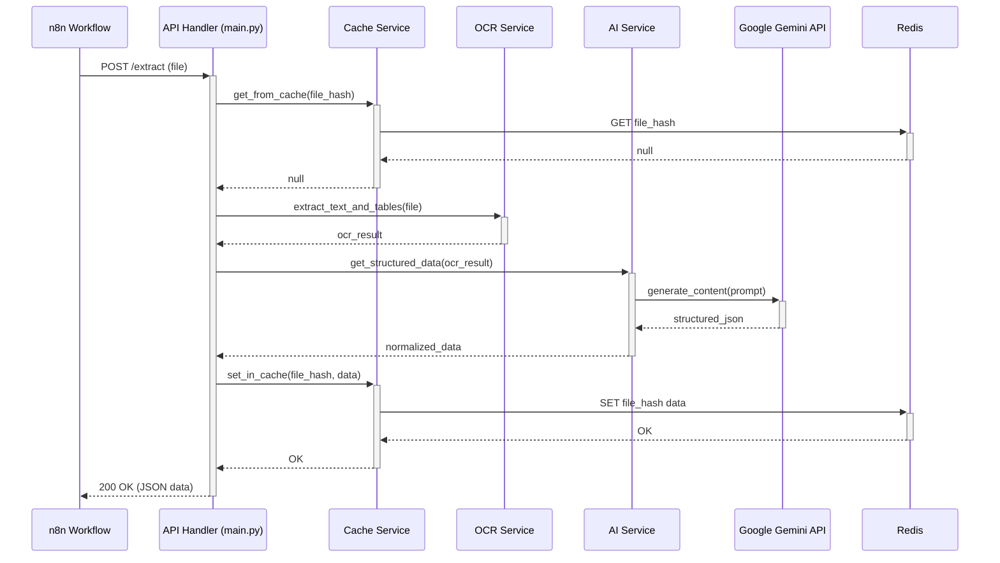

# 7. Core Workflows

This diagram illustrates the sequence of events for the primary success path: processing a new invoice that is not yet in the cache.

## 7.1. Invoice Extraction (Cache Miss)

**Other Workflows:**

-   **Cache Hit:** If the `Cache Service` finds the file hash in Redis, it immediately returns the cached JSON data to the `API Handler`, which then returns it to the client. The OCR and AI services are not called.
-   **Error Handling:** If at any point a component encounters a critical error (e.g., the AI Service receives an error from the Gemini API), it will propagate the error up to the `API Handler`, which will format and return a standardized JSON error response to the `n8n Workflow` with an appropriate HTTP status code (e.g., 400 or 500).

---
